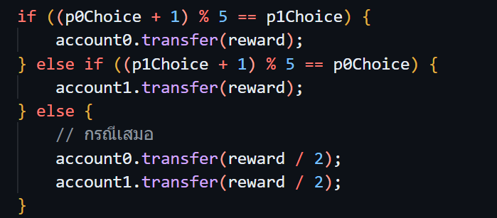

# อธิบายโค้ดที่ป้องกันการ lock เงินไว้ใน contract และ อธิบายโค้ดส่วนที่จัดการกับความล่าช้าที่ผู้เล่นไม่ครบทั้งสองคนเสียที

ผู้เล่นที่อยากจะถอนเงินออกให้เรียกใช้งาน method "withdrawnMoney" โดยที่จะมีเงี่อนไขการทำงานและผลลัพท์ดังนี้
1. ผู้เล่นเดียว: ถ้าผู้เล่นเข้าร่วมเล่นแล้วไม่มีผู้เล่นอีกคนเข้ามา ภายใน 20 วินาที ผู้เล่นสามารถถอนเงินออกได้

2. ผู้เล่นครบ แต่ไม่มีใคร commit: เมื่อมีผู้เล่นครบทั้งสอง แต่ยังไม่มีใคร commit คำตอบภายใน 60 วินาทีหลังจากผู้เล่นคนที่ 2 เข้าร่วม ระบบจะแบ่งเงินให้ทั้งสองฝ่ายเท่า ๆ กัน
3. ผู้เล่นครบ แต่มีเพียง 1 คนที่ commit: หากมีผู้เล่นครบทั้งสอง แต่มีเพียงคนเดียวที่ commit คำตอบภายใน 60 วินาทีหลังจากผู้เล่นคนที่ 2 เข้าร่วม ฝ่ายที่ไม่ commit จะถูกปรับให้แพ้ทันที (ข้อหาเข้ามาแล้วไม่เล่น ทำให้ผู้อื่นเสียเวลา)

4. ทั้งคู่ commit แต่ไม่มีใคร reveal: หากทั้งสองฝ่าย commit คำตอบแล้ว แต่ไม่มีใครเปิดเผยคำตอบภายใน 30 วินาทีหลังจากผู้เล่นคนสุดท้าย commit ระบบจะแบ่งเงินให้ทั้งสองฝ่ายเท่า ๆ กัน
5. ทั้งคู่ commit แต่มีเพียง 1 คนที่ reveal: หากทั้งสองฝ่าย commit คำตอบแล้ว แต่มีเพียงคนเดียวที่เปิดเผยคำตอบภายใน 30 วินาทีหลังจากผู้เล่นคนสุดท้าย commit ฝ่ายที่ไม่เปิดเผยคำตอบจะถูกปรับให้แพ้ทันที

# อธิบายโค้ดส่วนที่ทำการซ่อน choice และ commit

จาก code เราจะให้ player ส่ง choice เข้ามาผ่าน commitChoice โดยที่จำเป็นต้องเตรียม choice ดังนี้
1. เลือก Choice: player ต้องเลือกตัวเลือกที่ต้องการ (ค่า 0-4)
2. สร้าง Encoded Data: สุ่มข้อมูล random byte จำนวน 31 bytes แล้วนำมาต่อท้ายกับ choice ที่เลือก ผลลัพธ์ที่ได้เรียกว่า encodedData (ดังรูปด้านล่าง)

3. Hash Data: นำ encodedData ผ่านฟังก์ชันแฮช keccak256 (เรียกใช้ผ่านเมธอด getHash) เพื่อให้ได้ผลลัพธ์ที่เรียกว่า digest
4. Commit: ส่ง digest ซึ่งเป็นตัวแทนของ choice ที่เลือกไปที่เมธอด commitChoice

# อธิบายโค้ดส่วนทำการ reveal และนำ choice มาตัดสินผู้ชนะ 

จาก code เราจะให้ player ส่ง encodedData เข้ามาผ่าน revealChoice 

1. ตรวจสอบความถูกต้อง: เมื่อผู้ใช้ส่ง encodedData เข้ามา Contract จะนำข้อมูลดังกล่าวผ่านฟังก์ชันแฮชและตรวจสอบว่าได้ digest ตรงกับที่ได้ commit ไว้หรือไม่ เพื่อยืนยันว่า encodedData กับ digest นั้นเป็นคู่ที่ถูกต้องและไม่มีการแก้ไข

2. การตัดสินผล: หลังจากที่ผู้เล่นทั้งสองได้ commit choice แล้ว ระบบจะเริ่มคำนวณหาผู้ชนะ

3. ดึงค่า Choice จริง: จาก encodedData ระบบจะดึง byte ที่ตำแหน่งที่ 32 (bytes[31]) ซึ่งเป็นตัวเลือกจริงของผู้เล่น จากนั้นแปลงค่าให้เป็น uint เพื่อเตรียมเข้าสู่ขั้นตอนการตัดสินผล

4. Logic การตัดสินผล: เมื่อได้ตัวเลือกจริงของผู้เล่นทั้งสองแล้ว Contract จะใช้ตรรกะการตัดสินผลตามกฎของเกม RPSLS (Rock, Paper, Scissors, Lizard, Spock)

- หากสังเกตรูปแบบการแพ้ชนะ จะพบว่ามี loop ทั้งหมด 2 แบบ คือ loop วงกลมด้านนอกและ loop รูปดาวด้านใน loop ที่เป็นวงกลมนั้นเรียบง่าย เราสามารถทำคณิตศาสจร์ modulo มาช่วยลดรูป logic ของเราได้ดังรูป

- Loop วงกลม: เป็นการคำนวณที่ทำได้โดยใช้ modulo เพื่อให้ logic เรียบง่ายขึ้น
- Loop รูปดาว: logic ของ loop นี้ไม่ได้ตรงไปตรงมาแบบนั้น เราจึงต้องมีการ transform จาก รูปดาวให้เป็นวงกลมที่จัดการได้ง่ายกว่าก่อนโดยใช้ mapping transform ก่อนนำไปเข้า logic แบบปกติ

